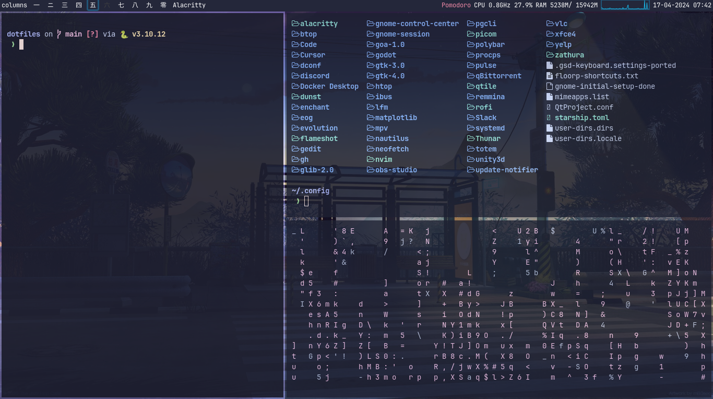

# dotfiles

- OS: [**Ubuntu 22.04.4 LTS**](https://releases.ubuntu.com/jammy/)
- Window Manager: [**Qtile**](https://qtile.org/)
- Compositor: [**Picom**](https://github.com/yshui/picom)
- Terminal: [**Alacritty**](https://alacritty.org/)
- Browser: [**Floorp**](https://floorp.app/en/)
- Menu: [**Rofi**](https://github.com/davatorium/rofi)
- Docs: [**Zathura**](https://github.com/pwmt/zathura)
- Notifications: [**Dunst**](https://github.com/dunst-project/dunst)
- File manager: [**Yazi**](https://yazi-rs.github.io/),  [**Thunar**](https://github.com/rgmf/xfce4-thunar) 
- Text editor: [**Neovim**](https://neovim.io/), [**VSCode**](https://code.visualstudio.com/)

---

## To do

- [x] Set LSP on Neovim
- [x] Yazi config
- [ ] Set Debugger on Neovim
- [ ] Customize Dunst
